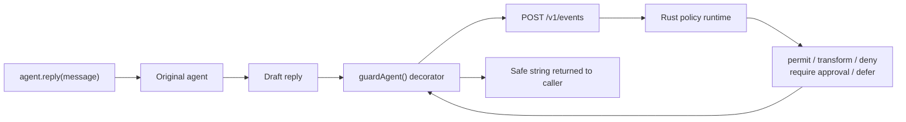

<div align="center">
  
  <h1>TrustLoopGuard</h1>
  <p><strong>The runtime firewall for AI agents.</strong><br/>
  Guard an agent's final reply <em>before</em> it ships — then <code>allow</code>, <code>block</code>, <code>rewrite</code>, or <code>escalate</code>.</p>

  <a href="LICENSE"></a>
  
  
  <br/>
  
  
  <a href="https://coderabbit.ai"></a>
</div>

---


Your agent is one response away from leaking a secret, getting prompt-injected,
or promising a refund it can't honor. **TrustLoopGuard catches it in the runtime
path — before the response reaches a user or a downstream system, not after, in
the logs.**

Just look at this:

```bash
npm install @trustloopguard/sdk
```

```ts
import { guardAgent } from '@trustloopguard/sdk';

const agent = guardAgent(createAgent(), { agentId: 'support-agent' });

const reply = await agent.reply(userMessage);
sendToUser(reply);
```

That is the intended SDK path: install one package, decorate the agent once
where it is created, and keep the rest of the app calling `agent.reply(...)`.
No scattered `look.check(...)`, no wrapper at every call site, no repository
clone, and no provider proxy setup.

- 🛡️ **Inspect** agent output before it reaches users or downstream systems
- 🚫 **Enforce** — block, rewrite, or escalate risky responses instead of only logging them
- 🔌 **Integrate** with `npm install @trustloopguard/sdk` and one `guardAgent()` call

## Integration Path

The SDK is the customer integration path. It calls the Rust runtime directly
and keeps enforcement at the application boundary the developer already owns.

Think of `guardAgent(...)` as a decorator around the agent object. The original
agent still produces the draft reply; the decorator catches that draft, sends it
to `POST /v1/events`, applies the returned decision, and only then resolves
`reply()`.

## How it works



<details>
<summary>Plain-text version (for renderers without Mermaid)</summary>

```text
agent.reply(message)
   -> original agent returns a draft
   -> guardAgent sends the draft to POST /v1/events
   -> Rust returns a decision
   -> guardAgent returns the permitted, transformed, or safe fallback string
```

</details>

TrustLoopGuard sits in the runtime path before an agent response reaches a
user or downstream system. `guardAgent()` wraps `reply()` once, so existing
call sites do not add checks, branches, or extra guard calls.

## Use cases

### Shell command guardrails

Tool policies can evaluate a proposed Bash action before execution, then deny
it or require an exact-action approval. Today, operators publish these policies
from YAML and manage their environment deployment from **Policies → Tool
command** in the dashboard.

[](docs/concept/command-safety.md#operator-demo)

See [Shell command safety](docs/concept/command-safety.md#operator-demo) for the
copyable policy examples and live-demo steps. Policy analysis treats the
command as structured input and never executes it.

### Safer outbound email

Content policies can target the `email` channel and transform risky wording
before the customer application sends it. A safe draft passes unchanged; a
refund guarantee is replaced with policy-approved language.

[](docs/policies/README.md#email-policy-demo)

See [Email policy demo](docs/policies/README.md#email-policy-demo) for the
copyable YAML and test flow. TrustLoopGuard evaluates a proposed message; it
does not send the email.

### Agent spending caps

Financial policies evaluate typed payment actions before execution. The same
control can permit routine spend, require approval above a threshold, and deny
an amount that breaches the hard cap.

[](docs/concept/financial-authorization.md#spending-cap-demo)

See [Spending cap demo](docs/concept/financial-authorization.md#spending-cap-demo)
for the dashboard values and expected decisions. Authorization analysis does
not execute a payment.

## Decision outcomes

| Decision | What happens | Common use |
| --- | --- | --- |
| `allow` | The agent output ships | Safe response or low-risk action |
| `block` | The output is stopped | Secrets, prompt injection, unsafe promises |
| `rewrite` | A safe alternative is returned | Customer support tone, policy-safe wording |
| `escalate` | A human review path takes over | High-risk or ambiguous cases |

## What it catches

Threats TrustLoopGuard is built to stop at the boundary:

- 🔑 Secret or PII leakage before a response reaches a user
- 💉 Prompt-injection attempts that manipulate agent behavior
- 📜 Unsafe support promises, refund guarantees, or policy violations
- ☣️ Toxic or off-brand responses in customer-facing agents
- ⚠️ High-risk outputs that should be escalated to a human

## Built for

- **AI agent builders** shipping customer-facing or workflow-driving agents
- **Engineering teams** adding policy checks before agent output reaches users
- **Security teams** worried about prompt injection, data leakage, and unsafe automation
- **Founders** building AI products that need trust, auditability, and control

## Supported surfaces

| Surface | Status | Use it for |
| --- | --- | --- |
| TypeScript SDK | ✅ Supported | Node, Next.js, agent apps |
| Python SDK | ✅ Supported | Python agents and backend workflows |
| Rust SDK | ✅ Supported | Rust services and low-latency integrations |
| MCP server | ✅ Local stdio adapter | Agent setup, run inspection, policy edits, and guard-event checks |
| Gateway proxy | ✅ Supported | OpenAI/Anthropic-compatible traffic |
| Dispute demo | 🧪 Demo available | Prompt-injection attack, unprotected vs guarded |
| LiveKit demo | 🧪 Demo available | Voice agent guardrails via the Python SDK |
| OpenAPI contract | ✅ Supported | External clients and generated contracts |

> Gateway streaming requests are not supported yet.

## How it compares

| Approach | Before output ships | Typed action | Rewrite path | Audit trace | Agent integration |
| --- | :---: | :---: | :---: | :---: | --- |
| Prompt instructions | Partial | No | No | No | Manual |
| Moderation API | Yes | Limited | No | Limited | Manual |
| Logs/monitoring | No | No | No | Yes | Manual |
| Offline evals | No | No | No | Partial | Manual |
| **TrustLoopGuard SDK** | **Yes** | **Yes** | **Yes** | **Yes** | **SDK call** |
| **TrustLoopGuard proxy** | **Yes** | **Yes** | **Yes** | **Yes** | **Provider base URL** |

## Features

- **Four actionable verdicts**: `allow`, `block`, `rewrite` with a safe alternative, or `escalate` to a human
- **Package-first SDK integration**: install one library and decorate your agent once without changing its reply call sites
- **⚡ Sub-millisecond hot path**: Tier 1 static matchers return in microseconds; Tier 2 adds 5-20 ms
- **Parallel-cancel orchestrator**: Tier 1/2/3 run in parallel; early verdicts cancel slower tiers
- **Channel-aware latency budgets**: chat and email can carry different deadline constraints
- **Policy-driven rule engine**: YAML policies declare matchers, severity levels, and the resulting action
- **Outbound email guardrails**: scope policies to proposed email content and transform unsafe wording before delivery
- **Shell command guardrails**: analyze proposed Bash, `sh`, and `zsh` actions without executing them, then deny, defer, or require exact-action approval
- **Financial spending caps**: permit routine typed payments, hold threshold exceptions for approval, and deny hard-cap breaches before execution
- **Agent profiles**: register scope, authority, and tone once; the LLM judge uses the profile for context
- **Three SDKs, one wire format**: TypeScript, Python, and Rust SDKs share codegen types from `tl-core`

## Quickstart

### 1. Create an agent and runtime key

In the TrustLoopGuard dashboard, create an agent and runtime API key. Copy the
agent ID, API URL, and key.

### 2. Install the SDK

```bash
npm install @trustloopguard/sdk
export TLG_URL=https://api.gettrustloop.app
export TLG_API_KEY=tl_live_...
```

### 3. Decorate the agent once

```ts
import { guardAgent } from '@trustloopguard/sdk';

const agent = guardAgent(createAgent(), { agentId: 'support-agent' });

const reply = await agent.reply(userMessage);
sendToUser(reply);
```

The SDK calls `POST /v1/events` with the agent ID and draft reply, using
`Authorization: Bearer <TLG_API_KEY>`. It applies the returned decision before
`reply()` resolves.

If your app currently has a function like this:

```ts
async function generateReply(message: string): Promise<string> {
  return await agent.reply(message);
}

const reply = await generateReply(userMessage);
sendToUser(reply);
```

decorate the agent at creation time instead of adding checks inside
`generateReply()`:

```ts
const agent = guardAgent(createAgent(), { agentId: 'support-agent' });
```

Everything downstream keeps calling `agent.reply(...)` or `generateReply(...)`
the same way.

### 4. Verify the trace

Send one test message, then open the agent's trace in the dashboard. No
TrustLoopGuard repository clone, Doppler setup, local Rust server, or provider
proxy is required for the hosted SDK path.

The reply decorator guards the final returned string. It does not automatically
capture hidden framework tool calls or payments; use the SDK's typed action
helpers when those boundaries also need enforcement.

See the [TypeScript SDK README](sdks/typescript/README.md) for the agent contract,
guard modes, streaming, and explicit side-effect helpers.

## SDKs

TypeScript, Python, and Rust SDKs share one wire format generated from
`tl-core`. The NPM package is the primary onboarding path; Python offers the
equivalent `@guarded` decorator.

## Runtime architecture

The evaluation engine runs three tiers in parallel and short-circuits on the
first hard verdict — fast threats die fast, deep checks only run when they have
to.

| Tier | Role | Latency target |
| --- | --- | --- |
| Tier 1 | Static matchers such as regex, PII, and Aho-Corasick | Microseconds |
| Tier 2 | Local classifiers | 5-20 ms |
| Tier 3 | Optional LLM judge with deadline bounds | 50-300 ms |

The first hard verdict short-circuits the rest. The SDK wrapper applies the
result before returning the reply to customer code.

## Contributing or self-hosting

The following setup is for people working on this repository or running their
own TrustLoopGuard server. SDK customers should use the four-step quickstart
above.

Secrets live in [Doppler](https://doppler.com), not in `.env` files. The repo
ships a `doppler.yaml` that points every app at the right project/config.

```bash
brew install dopplerhq/cli/doppler   # or see docs.doppler.com/docs/install-cli
doppler login                        # opens browser, stores token in ~/.doppler
doppler setup                        # reads doppler.yaml, links all dirs
```

From now on, `pnpm dev`, `make server`, `make agent-demo`, etc. inject secrets
automatically via `doppler run --`. No `.env.local` needed.

Start the server:

```bash
make server                          # = doppler run -- cargo run -p tl-server
```

Wait for `Listening on 0.0.0.0:8080`. Leave it running.

`make server`, `make server-watch`, and `make dev` default to the colorized
local backend formatter. To run the same format without Make:

```bash
TL_LOG_FORMAT=pretty doppler run -- cargo run -p tl-server
```

Direct `cargo run` still defaults to JSON for log collectors. In pretty mode,
successful HTTP responses are logged at `INFO`, client errors at `WARN`, and
server errors at `ERROR`, so normal terminals render them green/yellow/red. Add
`RUST_LOG=tl_server=debug` when you need request-start headers too.

## SDK-backed demos

Start `tl-server`, then run the demo surfaces from the repo root:

```bash
pnpm --filter @trustloopguard/demo dispute:check  # offline parser smoke test
pnpm --filter @trustloopguard/demo dispute:serve  # raw + guarded attack targets
```

The LiveKit voice-agent demo lives under `demo/livekit` and uses the Python SDK
inside the LiveKit Agents runtime. See [`demo/README.md`](demo/README.md).

## Where things live

| Path | Purpose |
| --- | --- |
| `crates/tl-core` | Wire types, the single source of truth |
| `crates/tl-engine` | Tier 1/2/3 evaluation pipeline |
| `crates/tl-server` | HTTP transport, OpenAPI annotations, gateway runtime |
| `crates/tl-sdk-rust` | Rust SDK |
| `apps/mcp-server` | Local stdio MCP server backed by the TypeScript SDK |
| `sdks/python` | Python SDK with Pydantic types from `tl-codegen` |
| `sdks/typescript` | TypeScript SDK with `ts-rs` types from `tl-codegen` |
| `docs/openapi.yaml` | Generated from `tl-server` annotations |
| `docs/SDK_DRIVEN.md` | Why every feature ships behind all three SDKs |
| `docs/AGENT_PROFILE.md` | Field-by-field reference for agent profile YAML |
| `docs/INTEGRATION.md` | Step-by-step guide to register and decorate an agent |
| `docs/concept/` | Architecture, glossary, and design decisions |
| `docs/diagrams/` | D2 sources for generated documentation diagrams |
| `demo` | SDK-backed demos for the dispute and LiveKit surfaces |

## Documentation diagrams

Diagram source lives in `docs/diagrams/*.d2`. Generated SVGs are committed for
both repo Markdown docs and the docs website.

```bash
pnpm docs:diagrams
# or
make diagrams
```

The command requires the D2 CLI. On macOS, install it with `brew install d2`.

## Contributing

TrustLoopGuard is built in the open and contributions are welcome. Bug reports
and pull requests both help — please open an issue to discuss larger changes
before submitting a PR.

The four rules every change follows are in
[`docs/SDK_DRIVEN.md`](docs/SDK_DRIVEN.md).

### Backend tests

Run the fast backend regression gate before changing Rust behavior:

```bash
pnpm test:backend
# or
make backend-test
```

This runs Rust unit tests and offline component tests across the workspace.
Coverage uses the same fast test set:

```bash
pnpm coverage:backend
```

Install `cargo-llvm-cov` first if needed:

```bash
cargo install cargo-llvm-cov
```

Docker-backed Postgres tests and live provider/embedder tests are explicit
opt-ins:

```bash
make backend-test-db
make backend-test-live
```

## License

Licensed under the [Apache License, Version 2.0](LICENSE).

The TrustLoopGuard name and logos are not licensed for trademark use by third
parties. Forks must not present themselves as the official TrustLoopGuard
project.
