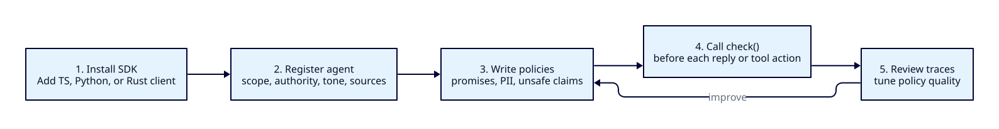

# Integrating TrustLoopGuard

This document is the **fastest path** from "we have an agent in production" to "every agent reply is run through TrustLoopGuard." It covers:

1. The two-step model: register the **agent profile** once, then call `guard()` on every reply.
2. **TypeScript** quickstart.
3. **MCP server** for local agent workbenches.
4. **Python** quickstart (sync + async).
5. **Raw HTTP** for any other language.
6. **Fail-open vs fail-closed**: what `guard()` does on transport errors and how to override.
7. **Guard modes**: choose whether unsafe drafts are blocked, rewritten, or regenerated.
8. **GitHub-assisted installation**: have TrustLoopGuard open a reviewable draft PR.

For the protocol itself see [`docs/openapi.yaml`](openapi.yaml). For why the runtime is shaped the way it is see [`docs/concept/v0-design-decisions.md`](concept/v0-design-decisions.md).

---



The integration is intentionally small: install the SDK, register the agent's
profile once, define policies, then call `guard()` before each draft leaves the
agent. The SDK submits a `GuardEvent` to `/v1/events`; production traces become
the feedback loop for improving policy quality.

If you want TrustLoopGuard to prepare the repository edit, use the dashboard's
GitHub-assisted path from an existing agent row. It installs a separate
selected-repository GitHub App, asks for the business risk to guard, generates a
bounded TypeScript/Next.js proposal, and opens a draft PR only after explicit
approval. See [GitHub-assisted installation](concept/github-assisted-installation.md).

## The two-step model

```
                      one-time, off the hot path
              ┌──────────────────────────────────────────┐
              │  POST /v1/agents  { yaml: "..." }        │
              └──────────────────────────────────────────┘

                      on every agent reply
                ┌──────────────────────────────┐
   user msg ──► │  your agent → draft          │
                │  guard({ agent_id, input,    │ ──► send to user
                │          draft, callbacks }) │
                └──────────────────────────────┘
```

You register the **agent profile** once (a YAML doc describing what the agent is allowed to say, its tone, who it is, where its knowledge comes from). After that, every check just sends `agent_id` plus the draft. Tier 3 LLM judges read the profile server-side — you never have to resend it.

A minimal profile:

```yaml
# policies/agents/acme-support-v3.yaml
agent_id: acme-support-v3
display_name: Acme customer support
scope:
  in_scope:
    - billing
    - account management
    - product setup
  out_of_scope:
    - legal advice
    - medical advice
authority:
  can_promise:
    - issuing refunds within 30 days
  cannot_promise:
    - lifetime discounts
    - access to unreleased features
tone:
  target: "warm, concise, factual"
  forbidden: ["promise", "guaranteed", "definitely"]
knowledge_sources:
  - kb_id: kb-v3
    kind: local
    description: Acme product knowledge base
  - kb_id: public-docs
    kind: web
    url: https://docs.acme.com/support
    description: Public support docs
```

Register it:

```bash
curl -X POST https://your-trustloopguard/v1/agents \
  -H "Authorization: Bearer $TL_API_KEY" \
  -H "Content-Type: application/yaml" \
  --data-binary @policies/agents/acme-support-v3.yaml
```

---

## Guard modes

Most integrations should create one guardrail at startup and call it before
each reply leaves the agent:

```python
import trustloopguard as trustloop

guardrail = trustloop.guard(
    agent_id="acme-support-v3",
    mode=trustloop.GuardMode.REWRITE,
)

reply = await guardrail(input=user_message, draft=agent_draft)
```

```ts
import { GuardMode, guard } from "@trustloopguard/sdk";

const guardrail = guard({
  agentId: "acme-support-v3",
  mode: GuardMode.Rewrite,
});

const reply = await guardrail({ input: userMessage, draft: agentDraft });
```

The mode controls what the SDK does after TrustLoopGuard checks a draft.

| Mode | Python | TypeScript | Use when |
|------|--------|------------|----------|
| Strict | `GuardMode.STRICT` | `GuardMode.Strict` | Unsafe output should stop immediately. |
| Rewrite | `GuardMode.REWRITE` | `GuardMode.Rewrite` | TrustLoopGuard safe output is enough. This is the default. |
| Rewrite or regenerate | `GuardMode.REWRITE_OR_REGENERATE` | `GuardMode.RewriteOrRegenerate` | The app should ask the model for a safer answer in real time when no safe output exists. |

Mode behavior:

| Verdict | `strict` | `rewrite` | `rewrite_or_regenerate` |
|---------|----------|-----------|--------------------------|
| `allow` | Return the original draft. | Return the original draft. | Return the original draft. |
| `rewrite` with `safe_output` | Return the block fallback. | Return `safe_output`. | Return `safe_output`. |
| `rewrite` without `safe_output` | Return the block fallback. | Return the block fallback. | Call `regenerate`, then guard the regenerated draft again. |
| `block` | Return the block fallback. | Return the block fallback. | Return the block fallback. |
| `escalate` | Return the escalation fallback. | Return the escalation fallback. | Return the escalation fallback. |

Regeneration must be capped so the agent cannot loop forever:

```python
async def regenerate_reply(feedback: trustloop.RegenerateFeedback) -> str:
    return await model.generate(
        instructions=(
            "The previous draft was blocked by TrustLoopGuard: "
            f"{feedback.reason}. Generate a safer answer."
        )
    )

guardrail = trustloop.guard(
    agent_id="acme-support-v3",
    mode=trustloop.GuardMode.REWRITE_OR_REGENERATE,
    regenerate=regenerate_reply,
    max_regenerations=1,
)
```

```ts
const guardrail = guard({
  agentId: "acme-support-v3",
  mode: GuardMode.RewriteOrRegenerate,
  maxRegenerations: 1,
  regenerate: async (feedback) => {
    return await model.generate({
      instructions:
        `The previous draft was blocked by TrustLoopGuard: ${feedback.reason}. ` +
        "Generate a safer answer.",
    });
  },
});
```

Use `rewrite_or_regenerate` only where the extra model call is acceptable.
Realtime agents often prefer `rewrite` or `strict` for lower latency.

---

## TypeScript quickstart

```bash
pnpm add @trustloopguard/sdk
# or: npm i @trustloopguard/sdk / yarn add @trustloopguard/sdk
```

```ts
import { Client, guard } from "@trustloopguard/sdk";

const client = new Client({
  baseUrl: process.env.TLG_URL!,
  apiKey: process.env.TLG_API_KEY!,
});

export async function reply(userMessage: string): Promise<string> {
  return client.withRun({
    agentId: "acme-support-v3",
    kind: "chat_session",
  }, async (run) => {
    const draft = await myAgent.generate(userMessage); // your existing agent

    return run.withEvent({ kind: "user_turn", metadata: {} }, () => guard({
      client,
      agentId: "acme-support-v3",
      input: userMessage,
      draft,
      context: { docs: await retrieveDocs(userMessage) },

      onBlock:    () => "I can't help with that — let me hand you to a teammate.",
      onEscalate: (d) => { humanQueue.push(d); return "Hold tight — a human is joining."; },

      // optional — defaults are fine
      onRevise: (revised) => revised ?? draft,
      onAllow:  (d) => d, // pass-through
      onError:  (_err, d) => d, // fail-open default

      log: (e) => logger.info({ tlg: e }),
    }));
  });
}
```

Verdict-to-callback mapping (same in both SDKs):

| verdict   | callback        | default                                     |
|-----------|-----------------|---------------------------------------------|
| `allow`   | `onAllow`       | return the draft unchanged                  |
| `rewrite` | `onRevise`      | return `decision.safe_output ?? draft`      |
| `block`   | `onBlock`       | **required** — you must provide this        |
| `escalate`| `onEscalate`    | **required** — you must provide this        |

---

## Financial actions and receipts

For refunds, payouts, invoice approvals, and other money-bearing actions, call the typed financial surface directly instead of wrapping the operation as a generic guard event.

```ts
await client.createFinancialPolicy({
  id: "refund-bot-refund-controls",
  description: "Refund controls for support agents",
  severity: "high",
  when: {
    agents: ["refund-bot"],
    action_kinds: ["refund"],
    operations: ["issue_refund"],
    currencies: ["USD"],
    rails: ["payment_http"],
  },
  per_transaction_minor: 10000n,
  hold_above_minor: 5000n,
  daily_minor: 50000n,
  monthly_minor: 500000n,
  allowed_counterparty_ids: [],
  denied_counterparty_ids: [],
  hold_new_counterparty: false,
  mandate_required: false,
  approver_roles: [],
  refund_original_method_only: false,
  required_preconditions: [
    "order_exists",
    "payment_captured",
    "refund_window_open",
    "amount_lte_refundable_balance",
  ],
  missing_evidence_action: "escalate",
  failed_precondition_action: "block",
  on_breach: "block",
});

const mandate = await client.createMandate({
  principal_id: "refund-bot",
  scope: { action_kinds: ["refund"], max_amount_minor: 10000n, currency: "USD" },
  metadata: { source: "customer_backend" },
});

const issueRefund = client.financialOperation({
  operation: "issue_refund",
  kind: "refund",
  principalId: "refund-bot",
  rail: "payment_http",
  amount: (input) => ({ amount_minor: input.amountMinor, currency: "USD" }),
  idempotencyKey: (input) => `refund:${input.orderId}:${input.amountMinor}`,
  counterparty: (_input, facts) => ({ id: facts.customerId, kind: "customer", metadata: {} }),
  mandate: () => ({ id: mandate.id, version: mandate.version }),
  metadata: (input) => ({ order_id: input.orderId, reason: input.reason }),
  evidence: (_input, facts) => [facts.refundEligibilityEvidence],
});

const action = await issueRefund.verify(
  { orderId: "order_123", amountMinor: 7500n, reason: "damaged_item" },
  {
    customerId: "cust_456",
    refundEligibilityEvidence: {
      source: "customer_backend",
      source_id: "refund_eligibility_check_789",
      kind: "refund_eligibility",
      metadata: { order_exists: true, payment_captured: true },
    },
  },
);

const decision = await client.getFinancialDecisionReceipt(action.id);
if (decision.decision === "hold") {
  console.log(decision.risks.map((risk) => risk.code));
}

const approved = action.status === "held" ? await client.approveAction(action.id) : action;
const executed = await client.executeAction(approved.id);
const receipt = await client.getReceipt(executed.id);

await client.recordActionOutcome(action.id, {
  action_id: action.id,
  status: "succeeded",
  reversal_capability: "manual_recovery",
  recovery_status: "manual_required",
  provider_status: "settled",
  provider_reference: "refund_123",
  occurred_at: new Date().toISOString(),
  metadata: { source: "stripe" },
});

const outcomes = await client.listActionOutcomes(action.id);
```

Python exposes the same flow as `client.create_financial_policy(...)`, `client.verify_action(...)`, `client.get_financial_decision_receipt(action.id)`, `client.execute_action(action.id)`, `client.get_receipt(action.id)`, `client.record_action_outcome(action.id, outcome)`, and `client.list_action_outcomes(action.id)`. Rust exposes `client.create_financial_policy(&req).await`, `client.verify_action(&req).await`, `client.get_financial_decision_receipt(&action.id).await`, `client.execute_action(&action.id).await`, `client.get_receipt(&action.id).await`, `client.record_action_outcome(&action.id, &outcome).await`, and `client.list_action_outcomes(&action.id).await`.

Decision receipts are pre-execution/action-decision proof; execution receipts are provider and ledger proof after execution. Spend windows use the financial ledger; receipts give operators and downstream systems the action/proof reference to audit what happened.

Outcomes are operational result records, not accounting state. Use them to record provider success/failure, reversal capability, recovery status, dispute/loss metadata, and provider references after execution or recovery attempts.

---

## MCP server

Use the local MCP server when a coding assistant or agent workbench should set
up TrustLoopGuard, submit guard events, and inspect runs without opening the
dashboard. It is a stdio adapter over the TypeScript SDK and the Rust `/v1/*`
API; it does not own storage or policy logic.

Build it from the repo root:

```bash
pnpm --filter @trustloopguard/mcp-server build
```

Example MCP client config:

```json
{
  "mcpServers": {
    "trustloopguard": {
      "command": "node",
      "args": ["/path/to/TrustLoopGuard/apps/mcp-server/dist/index.js"],
      "env": {
        "TLG_URL": "http://127.0.0.1:8080",
        "TLG_API_KEY": "tl_live_..."
      }
    }
  }
}
```

The server exposes thin SDK-backed tools for:

- runtime checks: `submit_guard_event`
- run workflows: `start_run`, `list_runs`, `get_run`, `create_run_event`, `finish_run`
- trace inspection: `list_traces`, `list_run_traces`
- setup and policy work: `list_agents`, `upsert_agent`, `list_policies`, `get_policy`, `upsert_policy`, `set_policy_enabled`
- tool registry work: `list_tool_metadata`, `upsert_tool_metadata`

`TLG_URL` defaults to `http://127.0.0.1:8080`; `TLG_API_KEY` is required.

---

## Python quickstart

```bash
pip install trustloopguard
```

### Sync

```python
import os
from trustloopguard import Client, guard

client = Client(
    base_url=os.environ["TLG_URL"],
    api_key=os.environ["TLG_API_KEY"],
)

def reply(user_message: str) -> str:
    with client.run(agent_id="acme-support-v3", kind="chat_session") as run:
        draft = my_agent.generate(user_message)
        with run.event(kind="user_turn"):
            return guard(
                client=client,
                agent_id="acme-support-v3",
                input=user_message,
                draft=draft,
                context={"docs": retrieve_docs(user_message)},
                on_block=lambda _d: "I can't help with that — let me hand you to a teammate.",
                on_escalate=lambda d: (human_queue.push(d), "Hold tight — a human is joining.")[1],
            )
```

### Async

```python
import os
from trustloopguard import AsyncClient, guard_async

client = AsyncClient(
    base_url=os.environ["TLG_URL"],
    api_key=os.environ["TLG_API_KEY"],
)

async def reply(user_message: str) -> str:
    async with client.run(agent_id="acme-support-v3", kind="chat_session") as run:
        draft = await my_agent.generate(user_message)

        async def block(_d): return "I can't help with that."
        async def escalate(d):
            await human_queue.push(d)
            return "Hold tight — a human is joining."

        async with run.event(kind="user_turn"):
            return await guard_async(
                client=client,
                agent_id="acme-support-v3",
                input=user_message,
                draft=draft,
                on_block=block,
                on_escalate=escalate,
            )
```

---

## Raw HTTP

For any language without a first-class SDK. The protocol is two endpoints:

### `POST /v1/agents`

Register/update an agent profile.

```bash
curl -X POST $TLG_URL/v1/agents \
  -H "Authorization: Bearer $TLG_API_KEY" \
  -H "Content-Type: application/yaml" \
  --data-binary @profile.yaml
```

### `POST /v1/events`

Submit a `GuardEvent` for a runtime decision.

```bash
curl -X POST $TLG_URL/v1/events \
  -H "Authorization: Bearer $TLG_API_KEY" \
  -H "Content-Type: application/json" \
  -d '{
    "kind": "output.proposed",
    "principal": {
      "workspace_id": "",
      "environment_id": "",
      "agent_id": "acme-support-v3"
    },
    "action": {
      "operation": "output",
      "parameters": { "text": "Yes, full refund within 14 days — guaranteed." },
      "side_effect": "none"
    },
    "sources": [
      { "id": "input.observed", "origin": "user", "labels": {} },
      { "id": "model.output", "origin": "unknown", "labels": {} }
    ],
    "provenance": {
      "text": ["model.output"]
    },
    "context": {
      "channel": "chat",
      "domain": "customer_support",
      "input_text": "Can I get a refund?",
      "docs": ["Refund policy: 30 days, see clause 4.2."]
    }
  }'
```

Response shape:

```json
{
  "trace_id": "018f0c43-…",
  "verdict": "rewrite",
  "reason": "Tone: forbidden word 'guaranteed'.",
  "triggered_policies": [...],
  "safe_output": "Yes — our refund window is 30 days.",
  "latency_ms": 142,
  "tier_results": [
    {"tier": "Deterministic", "elapsed_ms": 1,  "status": "Allow",   "reasons": []},
    {"tier": "Fuzzy",         "elapsed_ms": 11, "status": "Allow",   "reasons": []},
    {"tier": "Llm",           "elapsed_ms": 128,"status": "Revise",  "reasons": ["tone:guaranteed"]}
  ]
}
```

Branch on `verdict` — `allow | rewrite | block | escalate`. Full schema is in [`docs/openapi.yaml`](openapi.yaml).

---

## Fail-open vs fail-closed

The runtime can fail in two places: the **network** (request never reaches TrustLoopGuard) and the **LLM/model route** (a configured judge route timed out, failed, or exhausted its budget).

### Network failures

Handled in the SDK. The `guard()` helper:

- **Default: fail-open.** If the check round-trip fails (network error, 5xx, retries exhausted), `guard()` returns the **original draft** so an outage on TrustLoopGuard's side doesn't take the agent down with it.
- **Fail-closed: pass an explicit `onError`.**

  ```ts
  onError: (_err, _draft) => "I'm having trouble right now — let me get a teammate."
  ```

  ```python
  on_error=lambda _err, _draft: "I'm having trouble right now — let me get a teammate."
  ```

The trade-off:

| Mode         | Availability | Safety | Use when |
|--------------|--------------|--------|----------|
| Fail-open    | Better       | Worse  | Brand-tone, soft policies. An outage shouldn't silence the agent. |
| Fail-closed  | Worse        | Better | PII, payments, regulated speech. An outage must NOT let the agent free-talk. |

A common pattern is **fail-open per-call, fail-closed per-policy**: run with the default `onError` for network failures, but make strict policies (`pii.*`, `payments.*`) high or critical severity with `block` or `escalate` actions. Deterministic literal/regex policies do not depend on a model route, and semantic policy judge uncertainty escalates high and critical policies server-side.

### LLM/model route failures

Server-side. Each configured `LlmRouter` route has a `deadline_ms`. Existing Tier 3 judges report skipped results on route timeout or budget exhaustion so the deterministic tiers still apply. Event semantic policies use the `semantic_policy` route: if the route is absent, semantic matchers are skipped; if the judge is ambiguous or unavailable, high and critical policies escalate while lower-severity policies fail open.

When `LlmRouter` exhausts its token budget for the tenant the entire Tier 3 reports `Skipped` with `reasons: ["budget_exceeded"]`. Tiers 1 and 2 still run; their reasons still apply.

---

## Bear-trap checklist

- [ ] Your `GuardEvent.principal.agent_id` matches the registered agent profile you expect policies and traces to reference.
- [ ] `TL_API_KEY` is set on both client and server. The server rejects requests without `Authorization: Bearer …` (except `/health`).
- [ ] You're passing `context.docs` when you have grounding to give Tier 3 — without docs, the hallucination judge will short-circuit to `Skipped`.
- [ ] Your `onBlock` and `onEscalate` are non-trivial — they're the customer-facing copy when something fired. The default `guard()` cannot pick these for you.
- [ ] If you need fail-closed, you've passed an explicit `onError` for network failures and modeled strict semantic policies as high or critical severity.
- [ ] You're logging `trace_id` on your side — it's the joinable id across your logs, ours, and the `traces` table.
