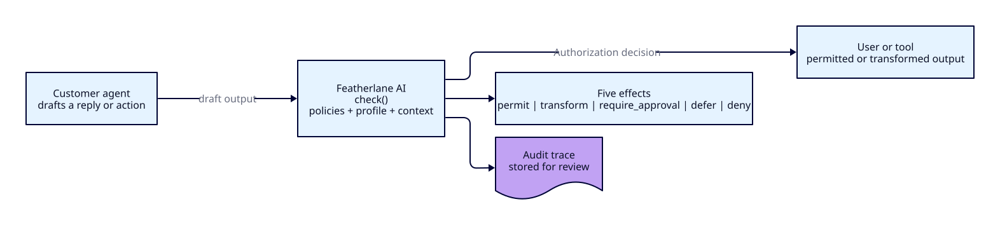

# Featherlane AI concepts

Plain-English explanations of every moving part. Read these in order if you're
new, or use the visual map below to jump to the part you need.

## What Featherlane AI is

> Ultra-low-latency runtime safety layer for production AI agents. The moment before an agent speaks, sends, clicks, or commits — Featherlane AI returns `permit | transform | require_approval | defer | deny`.

Customers integrate one primitive into their agent loop:

```
agent tool/reply → guardAgent(...) → GuardEvent → authorization kernel → safe execution + trace
```

That runtime check is the product. SDK callers receive the decision and handle it in code; gateway callers route provider traffic through Featherlane AI and let the Rust proxy apply dashboard-managed enforcement.



## Visual map

| What you need to understand | Start here | What the diagram explains |
|---|---|---|
| The product concept | [architecture.md](architecture.md) | Featherlane AI is a gate in the agent output path, not the agent itself. |
| Runtime data ownership | [architecture.md](architecture.md#runtime-data-flow) | SDKs and the dashboard both reach Rust; the dashboard does not own guardrail state. |
| Event-engine contract | [event-engine.md](event-engine.md) | `GuardEvent` vocabulary, event-stage seams, policy evaluation, and decision evidence. |
| TypeScript agent adapters | [sdk-agent-adapters.md](sdk-agent-adapters.md) | How one agent wrapper discovers and guards supported local tools. |
| Authorization kernel | [authorization-kernel.md](authorization-kernel.md) | Shared effects, approvals, grants, leases, and receipts across every domain. |
| Shell command safety | [command-safety.md](command-safety.md) | Tool policies and deterministic shell facts. |
| Coding-agent tool gates | [coding-agent-tool-gates.md](coding-agent-tool-gates.md) | Claude Code, Codex, and OpenCode installation, coverage, and lease lifecycle. |
| Financial authorization | [financial-authorization.md](financial-authorization.md) | Typed financial policy, execution, ledger, outcome, and reversal semantics. |
| Policies | [policies.md](policies.md) | Unified Rust policy registry, policy families, environment deployment, and domain wrappers. |
| Environments | [environments.md](environments.md) | Runtime keys, policy deployments, runs, traces, and analytics are scoped by environment. |
| Post-run evaluations | [evaluations.md](evaluations.md) | Finalization, capture barriers, immutable snapshots, agent policy manifests, graders, and release gates. |
| Telemetry capture | [telemetry-capture.md](telemetry-capture.md) | Direct OTLP/HTTP correlation, privacy, limits, and optional Collector deployment. |
| Product usage analytics | [product-analytics.md](product-analytics.md) | PostHog observes marketing and dashboard use without owning guardrail/runtime data. |
| Policy authoring | [../policies/README.md](../policies/README.md) | YAML policies are validated, saved, evaluated, and then surfaced in traces. |
| Customer integration | [../INTEGRATION.md](../INTEGRATION.md) | Teams install an SDK, register an agent, decorate it once, then tune from traces. |
| First-party LLM selection | [llm-routing.md](llm-routing.md) | One manifest routes runtime judges, control-plane assistance, and bundled demos. |

## Reading order

1. [architecture.md](architecture.md) — the big picture: how the pieces fit, how a request flows, where the latency goes.
2. [event-engine.md](event-engine.md) — the SDK-first event contract and no-op runtime seams.
3. [authorization-kernel.md](authorization-kernel.md) — how intents, approvals, grants, claims, leases, and receipts form one authority lifecycle.
4. [financial-authorization.md](financial-authorization.md) — the typed financial action contract and policy family.
5. [command-safety.md](command-safety.md) — how proposed shell commands become policy evidence and exact authorization.
6. [coding-agent-tool-gates.md](coding-agent-tool-gates.md) — how coding-agent host calls reach the runtime.
7. [crates.md](crates.md) — what each crate is for, in order of dependency.
8. [glossary.md](glossary.md) — every domain term defined once: Channel, Authorization effect, Policy, Decision, hot path, etc.
9. [runs.md](runs.md) — how agent executions group decision traces for monitoring.
10. [evaluations.md](evaluations.md) — how completed Runs become immutable per-agent assurance evidence.
11. [telemetry-capture.md](telemetry-capture.md) — how OTLP spans are safely correlated and retained.
12. [analytics-dashboards.md](analytics-dashboards.md) — how customizable analytics queries and saved dashboard views work.
13. [gateway.md](gateway.md) — how proxy/gateway mode differs from SDK mode.
14. [agent-breakaway-arena.md](agent-breakaway-arena.md) — the raw-vs-guarded comparison concept and the agent adapter contract the demos use.
15. [sdk-publishing.md](sdk-publishing.md) — how `@featherlane-ai/sdk` is released to npm.
16. [cli-publishing.md](cli-publishing.md) — how `@featherlane-ai/cli` is released to npm.
17. [sdk-agent-adapters.md](sdk-agent-adapters.md) — how TypeScript agent wrappers discover local tools and where visibility stops.
18. [llm-routing.md](llm-routing.md) — how first-party LLM workloads select providers, models, reasoning, deadlines, and fallbacks.

## When to update these docs

- Changed the shape of `GuardEvent` or `Decision`? → update `glossary.md` and `architecture.md`.
- Added a new crate or split one? → update `crates.md`.
- Changed how a request flows through the system? → update `architecture.md`.
- Changed the event-engine contract or stage seams? → update `event-engine.md`.
- Changed the financial action contract, financial policy family, outcome semantics, or reversal vocabulary? → update `financial-authorization.md` and `glossary.md`.
- Changed shell command facts or tool policy semantics? → update `command-safety.md` and `glossary.md`.
- Changed coding-agent installation, host adapters, coverage, or lease reconciliation? → update `coding-agent-tool-gates.md` and `glossary.md`.
- Changed the proxy integration path? → update `gateway.md`.
- Added or changed execution grouping? → update `runs.md`.
- Changed the SDK release workflow or npm package process? → update `sdk-publishing.md`.
- Changed the coding-agent CLI release workflow or npm package process? → update `cli-publishing.md`.
- Changed TypeScript framework discovery or automatic tool wrapping? → update `sdk-agent-adapters.md`.
- Changed the raw-vs-guarded comparison concept or the agent adapter contract? → update `agent-breakaway-arena.md`.
- Changed PostHog initialization, identity, or product event names? → update `product-analytics.md`.
- Changed first-party LLM route selection or budget boundaries? → update `llm-routing.md`.

## Diagram workflow

Architecture diagrams are generated from D2 source files in
[`../diagrams`](../diagrams). Edit the `.d2` file first, then regenerate the
SVG assets used by both repo Markdown and the docs website:

```bash
pnpm docs:diagrams
# or
make diagrams
```

The command requires the D2 CLI. On macOS:

```bash
brew install d2
```

Keep these docs short. If something gets long, split it. The point is to onboard a new contributor in 15 minutes, not to be exhaustive.
