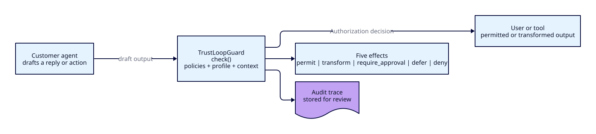
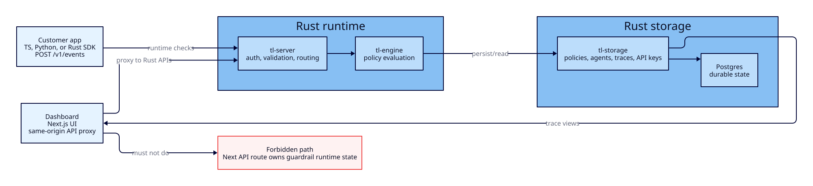

# Architecture

> **v0 readers:** the layered "short-circuit on first hard block" model described below was the original v1 sketch. The runtime that actually ships in v0 runs all three tiers **in parallel with cancellation** — see [`v0-design-decisions.md` §4](v0-design-decisions.md) for the parallel-cancel orchestrator, the `HandlerCtx` shape, the `LlmRouter`, and the cache/storage/escalation wiring. Use this document for the high-level shape and integration story; use the design-decisions doc for what actually runs.

## What TrustLoopGuard is, in one sentence

A guardrail runtime that customers call **before** their AI agent's output reaches the outside world. It returns a verdict in milliseconds.

## The shape of one call



```
+-------------------+      CheckRequest       +-------------------+
|  Customer's       |  ────────────────────►  |  TrustLoopGuard   |
|  agent loop       |                         |  (tl-server)      |
|                   |                         |                   |
|  proposed_output  |  ◄────────────────────  |    Decision       |
+-------------------+      Decision           +-------------------+
                                                       │
                                                       ▼
                                              decision log (tl-storage)
```

The customer's agent does not stop being smart. TrustLoopGuard is a **gate**, not a brain. It says "this output is fine" or "this output is dangerous, here's a safer one."

## Runtime data flow



Runtime checks do not pass through the dashboard. Customer applications call
the Rust API through one of the SDKs. The dashboard calls same-origin Next.js
API routes only so browser code gets authentication, workspace resolution, and
camelCase/snake_case translation in one place. Those routes still proxy to
Rust; they do not own runtime guardrail state.

That boundary keeps one source of truth:

| Data or behavior | Owner | Why |
|---|---|---|
| Runtime checks and verdicts | `crates/tl-server` + `crates/tl-engine` | The hot path must be shared by SDK, HTTP, and dashboard-visible traces. |
| Policies, agents, traces, API keys, knowledge sources | `crates/tl-storage` | Durable guardrail data must not split between Rust and the web app. |
| Dashboard pages and browser-friendly proxy routes | `apps/web` | The web layer handles UI concerns, session context, and same-origin calls. |
| Wire contracts | `crates/tl-core` | SDKs, OpenAPI, server handlers, and storage agree on one type vocabulary. |

## Two ways customers integrate

There is no third option in v1.

1. **HTTP SDK** — `POST /v1/check` to a hosted server (`tl-server`). The customer uses our SDK (`tl-sdk-rust`, or generated TS/Python) and handles the returned decision in code.
2. **Gateway** — provider-compatible proxy endpoints under `/v1/gateway/*`. The customer routes AI traffic through TrustLoopGuard, and the Rust gateway applies dashboard-managed enforcement behavior before returning a provider-shaped response. See [gateway.md](gateway.md).
3. **Embedded** — for users who want zero network hop, they pull `tl-engine` directly as a Rust dependency and call `Engine::check(&req)` in-process. Same types, no HTTP.

Both paths run the **same engine code**. The server crate is a thin axum wrapper around the engine.

## Layered model: input to verdict

Every check goes through these layers, in order, and short-circuits on the first hard block.

```
CheckRequest
    │
    ▼
┌───────────────────────────────────────────┐
│ Server redaction stage                    │
│   optional defense-in-depth sanitization  │
└───────────────────────────────────────────┘
    │ sanitized request
    ▼
┌───────────────────────────────────────────┐
│ Layer 1: Static matchers                  │  ← microseconds
│   regex, literal (Aho-Corasick), PII      │
└───────────────────────────────────────────┘
    │ no hard block?
    ▼
┌───────────────────────────────────────────┐
│ Layer 2: Local classifiers (later)        │  ← 5-20 ms
│   small models via ONNX / candle          │
└───────────────────────────────────────────┘
    │ no hard block?
    ▼
┌───────────────────────────────────────────┐
│ Layer 3: Remote LLM judge (opt-in)        │  ← 50-300 ms, deadline-bound
│   only when a policy explicitly opts in   │
└───────────────────────────────────────────┘
    │
    ▼
Decision { verdict, reason, triggered_policies, safe_output, latency_ms, redaction }
```

**Layer 1 is the moat.** Voice-channel checks must finish in Layer 1. Layers 2 and 3 are off-path for voice unless the policy author accepts the latency cost.

## Request lifecycle (HTTP path)

Concrete trace of one `POST /v1/check`:

| Step | Where | What happens |
|---|---|---|
| 1 | `tl-server/src/main.rs:24` | `axum::serve` accepts the connection |
| 2 | router | path matches `/v1/check`, dispatches to `check_handler` |
| 3 | `tl-server/src/main.rs:11` | axum extracts `Json<CheckRequest>` and shared `AppState` |
| 4 | server | resolves workspace settings; `redacted_only` workspaces reject obvious raw sensitive values unless redaction metadata says redaction was applied or explicitly requests server redaction |
| 5 | server | when `CheckRequest.redaction.mode = server`, redacts `input`, `proposed_output`, configured context strings, and inline run-event summaries before engine/cache/trace paths |
| 6 | `tl-engine/src/lib.rs` | `Engine::check_async_with_policies(&req, ...)` runs against the sanitized request |
| 7 | `tl-engine/src/engine_match.rs` | each policy's matchers run against `proposed_output` |
| 8 | engine | first triggered policy's `Action` becomes the `Verdict` |
| 9 | server | `Decision` is serialized as JSON, returned over HTTP |
| 10 | (later) `tl-storage` | decision is persisted asynchronously |

Steps 5–8 are the **hot path**. They must be allocation-light and lock-free for the voice latency budget. Hosted server redaction is defense in depth; customers with hard residency rules should redact in the SDK or inside their own environment before calling hosted `/v1/check`.

## Latency budget (committed)

These are the numbers we put in marketing. The architecture exists to honor them.

| Channel | Mode | p99 budget | What's allowed |
|---|---|---|---|
| Voice | streaming | < 50 ms | Layer 1 only |
| Chat | sync | < 150 ms | Layer 1 + Layer 2, optional fast Layer 3 |
| Email / async | sync | < 500 ms | All layers |
| Replay / audit | offline | best-effort | All layers, full LLM grading |

If we cannot keep these p99s with realistic policy sets, the wedge falls apart. Treat any change that risks them as a P0.

## What is explicitly NOT in v1

- **Tool/permission/credential layer** — Clawvisor's territory. We interoperate, we don't compete.
- **Coding-agent diff review** — different product surface; defer.
- **Browser-agent action approval** — defer.
- **Workflow / orchestration / agent platform** — never in scope.
- **Non-engineer policy UI** — v1 ships YAML in Git. UI is v2 once shape stabilizes.

## Dashboard-owned surfaces

Some durable surfaces are dashboard-facing only — Rust still owns them, but they don't sit on the guardrail hot path. They share the same `/v1/...` API discipline.

- **Runs** — one execution of a registered customer agent, such as a chat session, live call, workflow execution, or background job. Runs are surfaced through `/v1/runs/*` and group persisted decision traces through `traces.run_id`. Ordered run events are stored in `run_events` and can be linked from traces through `traces.run_event_id`. SDK callers may create runs explicitly; gateway model requests create a `chat_session` run automatically. They are observability containers only; TrustLoopGuard does not orchestrate customer agents or workflows. See [runs.md](runs.md).
- **Custom analytics dashboards** — Rust-computed analytics queries and saved workspace dashboard views, surfaced through `/v1/analytics/catalog`, `/v1/analytics/query`, and `/v1/analytics/views/*`. The web dashboard may provide Datadog-style filters and widget controls, but saved views and query semantics are Rust-owned. See [analytics-dashboards.md](analytics-dashboards.md).
- **Human review analytics** — append-only `human_review_events` linked to persisted traces, surfaced through `/v1/traces/{trace_id}/review-events` and `/v1/analytics/human-review`. They record customer review outcomes for monitoring and audit without turning TrustLoopGuard into a review queue. See [human-review-analytics.md](human-review-analytics.md).
- **Workspace policies** — policy authoring, listing, editing, delete, and enablement changes are Rust-owned through `/v1/policies/*`. The dashboard may batch-enable or batch-disable policies through `PATCH /v1/policies/batch/enabled`; runtime checks only load enabled policies.
- **Workspace team + invites** — `workspace_members` and `workspace_invites`, surfaced via `/v1/team/*`. See [team-and-invites.md](team-and-invites.md).
- **Workspace API keys** — `workspace_api_keys`, surfaced via `GET /v1/api-keys`, `POST /v1/api-keys`, and `PATCH /v1/api-keys/batch/revoke`. Runtime SDK and gateway model requests send these as `Authorization: Bearer tl_live_...`; the middleware resolves the workspace from storage. See [authorization.md](authorization.md#workspace-api-keys).
- **Gateway configuration** — provider connections, gateway routes, and enforcement profiles are Rust-owned through `/v1/gateway/*` and `/v1/enforcement-profiles`. Runtime keys may use gateway model endpoints but cannot manage this configuration. Gateway model traffic also terminates in Rust, not the web app. See [gateway.md](gateway.md).
- **OAuth identity links** — `oauth_identities`, surfaced through `POST /v1/identity/oauth-session`. Google/GitHub authenticate the browser user; Rust maps the provider account to one local `users.id` before workspace membership checks run. See [authorization.md](authorization.md#oauth-users-google--github).
- **Hosted user approval** — `users.is_approved` gates TrustLoopGuard-operated staging and production dashboard access when `TL_HOSTED_DEPLOYMENT=true`. Self-hosted deployments leave that hosted flag unset. See [authorization.md](authorization.md#three-lanes-one-middleware).

## End-state to keep in mind

The repo is built so any of these can be added without re-architecting:

- A second binary (e.g. `tl-edge`) that embeds `tl-engine` as a sidecar with no HTTP.
- A gRPC interface (just a new transport over the same engine).
- Postgres / ClickHouse decision logs (swap the `DecisionStore` impl, no engine change).
- Provider integrations (LiveKit, Pipecat, OpenAI middleware) — each is a new example crate, not a core change.

The crate boundaries (see [crates.md](crates.md)) exist precisely so these additions are mechanical.
