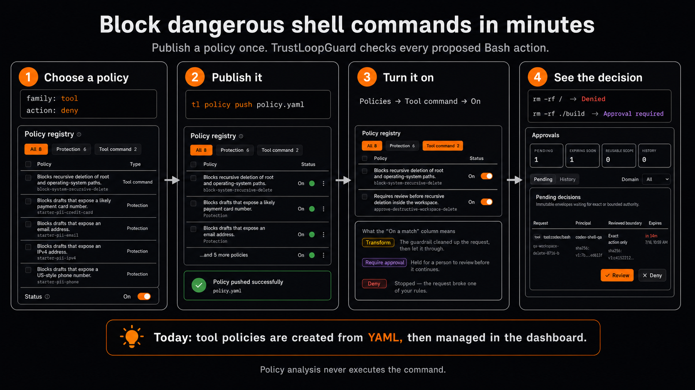

# Shell command safety

Shell command safety is the Rust-owned path that evaluates a proposed Bash, `sh`, or `zsh` command before a coding agent executes it. It uses the unified policy registry and the common authorization kernel; it is not a hardcoded command blocklist or a second policy service.

## Request and ownership

Callers submit `shell.action.proposed` to `POST /v1/events`. The action must carry a stable invocation id, a complete tool identity, and parameters shaped as:

```yaml
command: rm -rf ./build
shell: bash
cwd: /workspace/project
workspace_root: /workspace/project
timeout_ms: 5000
run_in_background: false
```

The Rust server validates that shape and always treats the event as `shell_exec`; a collector cannot downgrade it by claiming `read` or `none`. The command remains JSON inside `Action.parameters` so the public event envelope stays compatible, while SDK helpers provide the typed `ShellActionParameters` surface.

```text
Claude Code or SDK
        |
        | shell.action.proposed
        v
Rust event pipeline -> exact tool subject -> enabled family: tool policies
                                              |
                         bounded shell facts -+-> authorization findings
                                              |
                                              v
                           deny / defer / approval / permit
                                              |
                            exact grant -> recheck -> execution lease
                                              |
                                      consume or cancel
```

`tl-core` owns the wire types, `tl-policy` owns the YAML contract, `tl-engine` owns pure analysis and matching, `tl-server` owns orchestration and traces, and `tl-storage` owns policy and authorization persistence. The dashboard only authors policies and displays Rust data.

## Tool policy contract

A `family: tool` policy scopes by agent, operation, side-effect class, or structured tool identity. Its match is one `fact` or `parameter` matcher, or a bounded `any`/`all` list of those matchers.

```yaml
family: tool
id: block-system-delete
severity: critical
when:
  agents: [coding-agent]
  operations: [Bash]
  side_effects: [shell_exec]
  tools:
    - server_id: claude-code
      tool_name: Bash
match:
  all:
    - fact: { key: shell.risk, equals: filesystem_recursive_delete }
    - fact: { key: shell.target_scope, one_of: [root, system] }
action: deny
reason: Recursive deletion of system paths is prohibited.
remediation: Use a disposable workspace path.
```

Tool policies allow `deny`, `defer`, and `require_approval`. They do not allow `permit` or `transform`: an unmatched policy already contributes no restriction, and command rewriting would change the exact executable subject.

Parameter matchers use an RFC 6901 JSON Pointer into the submitted parameters and exactly one of `equals`, `one_of`, or `regex`:

```yaml
match:
  parameter:
    path: /command
    regex: '(?i)acme-prod\s+destroy'
```

Parameter matching is intentionally available for organization-specific tools and vocabulary. It does not become a built-in parser rule.

## Operator demo

Tool-command policies are currently authored as YAML, published to the selected
workspace environment, and then managed from **Policies → Tool command** in the
dashboard.



For a short demonstration:

1. Start with one of the validated examples in
   [`docs/policies/examples`](../policies/examples.md#shell-command-controls).
2. Validate and publish it with `tl policy validate <file>` and
   `tl policy push <file>`.
3. Confirm the policy is on for the intended environment under
   **Policies → Tool command**.
4. Submit a proposed shell action and show the resulting deny or exact-action
   approval in the dashboard.

The analyzer treats the command as structured input. It does not execute the
command while producing facts or a policy decision.

## Shell facts

The analyzer parses executable syntax with Tree-sitter's Bash grammar and walks command, pipeline, wrapper, nested static `bash|sh|zsh -c`, and redirection nodes. It never runs a shell or reads the filesystem, process state, network, or environment.

Currently emitted fact keys are:

| Key | Representative values |
|---|---|
| `shell.program` | normalized executable basename |
| `shell.wrapper` | `sudo`, `env`, `command`, `builtin`, `nohup`, `time`, `shell_c`, `xargs` |
| `shell.flag` | `recursive`, `force`, `no_preserve_root`, `hard` |
| `shell.pipeline` | `true` |
| `shell.redirection` | `overwrite`, `append` |
| `shell.dynamic` | `true` |
| `shell.target_scope` | `root`, `system`, `home`, `workspace`, `outside_workspace`, `temporary`, `vcs_metadata`, `unknown` |
| `shell.risk` | `filesystem_recursive_delete`, `filesystem_overwrite`, `disk_overwrite`, `vcs_history_rewrite`, `vcs_untracked_delete`, `container_destructive`, `infrastructure_destroy`, `privilege_change`, `process_termination`, `dynamic_evaluation`, `database_destructive`, `download_execute` |

Facts are neutral evidence. They do not carry an authorization effect. Only an enabled workspace policy decides whether a fact means deny, defer, or require approval.

Quoted text, comments, and heredoc data are not treated as executable commands. Dynamic values and malformed or bounded-out syntax are marked incomplete instead of guessed from raw text.

## Bounds and incomplete analysis

Analysis is deterministic and bounded to 65,536 command bytes, 20,000 syntax nodes, 1,024 command invocations, four nested static shell payloads, and 1,024 values per fact key. Its status is:

- `complete`: all visited syntax was statically analyzed within the bounds;
- `partial`: parsing, dynamic syntax, or a traversal bound left relevant evidence unresolved;
- `unavailable`: the command exceeded the pre-parse byte bound.

A proven fact can still match during partial analysis. If a scoped fact policy cannot be proven false because relevant analysis is partial or unavailable, its finding becomes `defer`. Parameter-only policies remain evaluable and skip shell parsing entirely. This prevents incomplete analysis from silently authorizing a scoped command while preserving explicit known denials.

## Approval and execution

`require_approval` produces an exact, non-reusable action requirement by default. The approval binds the principal, invocation, operation, tool identity, schema hash, side effect, and full parameters. Approval creates a grant; the caller must resubmit the same event with that grant and a stable attempt id. The kernel rechecks current policy before returning `permit` with a one-attempt lease.

The executor completes that lease as `consumed` after success or `canceled` after failure. A changed command or identity does not fit the approved scope. See [authorization-kernel.md](authorization-kernel.md) for the shared lifecycle.

## Coding-agent execution

Claude Code, Codex, and OpenCode can submit this typed shell event through the user-owned coding-agent tool gate. Installation, strict failure behavior, host coverage, and lease reconciliation are owned by [coding-agent-tool-gates.md](coding-agent-tool-gates.md).

## Clean-room boundary

This implementation was designed from TrustLoopGuard's existing event, policy, and authorization contracts plus official Tree-sitter and Claude hook documentation. No source, rule list, test corpus, generated artifact, or benchmark from the externally referenced destructive-command project is copied, translated, or used as implementation material.

The examples under `docs/policies/examples/tool-shell-*.yaml` are documentation fixtures only. They are not seeded or enabled automatically; an operator must deliberately publish and enable the policies they want.
