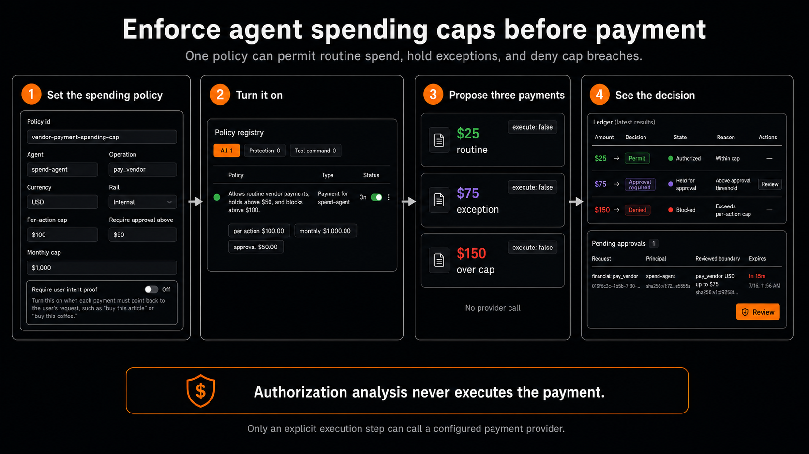

# Financial authorization and execution

Financial actions are typed domain commands for payments, refunds, payouts, purchases, invoice approvals, treasury transfers, and x402 payments. They use the shared [authorization kernel](authorization-kernel.md) for authority and retain financial-only execution and ledger invariants.

## Ownership

- `crates/tl-core`: financial wire types and `FinancialExecutionStatus`.
- `crates/tl-engine`: pure `family: financial` matching and effect generation.
- `crates/tl-server`: the financial adapter, live eligibility/budget checks, provider execution, and HTTP handlers.
- `crates/tl-storage`: actions, ledger entries, execution receipts, outcomes, reservations, and the common authorization repositories.
- `apps/web`: thin proxies and ledger/history presentation. It has no approval mutation routes.

## Product state and independent lifecycle axes

Every `FinancialActionRecord` exposes:

- `state`: the Rust-derived product state used by callers and the dashboard: `evaluating`, `authorized`, `held_for_approval`, `blocked`, `not_executable`, `executing`, `executed`, `failed`, `canceled`, or `reversed`.
- `state_reason`: the product-facing explanation when a state needs one, such as `Amount exceeds refundable balance`.
- `authorization_effect`: `permit`, `deny`, `require_approval`, or `defer`; financial actions cannot use `transform`.
- `authorization_status`: the shared durable intent lifecycle.
- `execution_status`: `not_started`, `executing`, `succeeded`, `failed`, `canceled`, or `reversed`.

`state` is a projection of the existing evidence, authorization, and execution fields; it is not a fourth durable state machine and requires no separate storage. Failed trusted evidence before an authorization intent exists produces `not_executable`. An evaluated policy denial produces `blocked`. An approved action is not an executed action: authorization answers whether execution may start now, while execution state records what the provider and ledger actually did.

## Request flow

1. The caller submits `POST /v1/financial/actions` with a typed action, evidence, idempotency key, and optional `AuthorizationClaim`.
2. The financial adapter derives a `financial:<operation>` capability and a typed `FinancialGrantScope`.
3. Current financial policies and trusted evidence emit hard findings plus stable authority requirements.
4. The common coordinator matches only the explicitly claimed grant. A grant must cover the principal, capability, requirement IDs, action kind, operation, rail, currency, amount, counterparty, and any x402 or precondition bounds.
5. If authority remains, the action appears in the one `/approvals` queue. Reviewer sign-off creates a common exact-once or scoped grant.
6. The caller retries with the grant and a stable attempt ID. Current policy, evidence, eligibility, and budget state are evaluated again.
7. Immediately before provider execution, the financial service atomically reserves live budget and claims a common execution lease.
8. Provider execution writes financial ledger entries and a `FinancialReceipt` linked to the common `AuthorizationReceipt`.
9. The lease is consumed on success or canceled on failure. Outcomes and reversals remain financial-domain records.

`POST /v1/financial/actions/{id}/execute` accepts an optional authorization claim and attempt ID. This lets an action be reviewed first and executed later without weakening the recheck boundary.

## Financial policy controls

Financial policies share the unified policy registry and use `family: financial`. Important controls include:

- `per_transaction_minor`, daily, weekly, and monthly hard caps;
- `approval_threshold_minor`;
- `grant_required`;
- `require_approval_for_new_counterparty`;
- counterparty allow/deny lists;
- trusted eligibility preconditions;
- `missing_evidence_effect`, which normally defaults to `defer`;
- `failed_precondition_effect` and `on_breach`, which normally use `deny`.

Policies create requirements; they do not create or discover grants. A saved grant can remove repeated human review only when it satisfies the current requirement. It never overrides a hard cap, failed eligibility check, missing evidence, revoked authority, or a live budget denial.

## Spending cap demo

The dashboard can create one financial policy that permits routine spend,
holds an exception for approval, and denies a hard-cap breach.

For the demo policy, open **Policies → New policy → Financial authorization**
and use:

- agent `spend-agent`, operation `pay_vendor`, currency `USD`, and rail
  `Internal`;
- per-action cap `$100`;
- require approval above `$50`;
- monthly cap `$1,000`;
- user intent proof off.

Then submit three typed payment actions with `execute: false`: `$25` returns
`permit` and `authorized`, `$75` returns `require_approval` and
`held_for_approval`, and `$150` returns `deny` and `blocked`. The held action
appears in `/approvals`; all three records appear in `/financial`.

Authorization analysis does not call a payment provider. Provider execution is
a separate explicit step after current policy and authority are rechecked.

## x402

x402 authorization uses the same financial adapter and grant model, with scope fields for host, resource, network, asset, payee, amount, and required preconditions. The agentic-payment endpoints retain their reservation, commit, and rollback lifecycle because signing and settlement are execution concerns. A common authorization receipt explains why signing was permitted; the financial receipt proves what settled.

## UI

- `/approvals` is the only actionable decision queue for both financial and non-financial work.
- `/grants` creates, lists, and revokes saved authority.
- `/financial` is a ledger and execution-history surface. It leads with the product state and reason while retaining the raw authorization and execution axes, and it has no approve/deny controls.

## Commercial coverage boundary

[Action underwriting](glossary.md#action-underwriting) is a separately agreed commercial layer outside the open-source authorization contract. The current `/v1/financial/actions` API authorizes and executes financial actions and records their outcomes; it does not quote a risk price, bind coverage, issue an insurance policy, or guarantee payment. Any coverage is available only under separate agreed terms.
