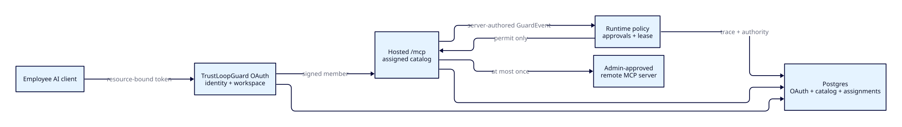

# Hosted MCP access gateway

The hosted MCP access gateway gives every workspace one remote MCP endpoint,
`$TL_PUBLIC_URL/mcp`. An employee adds that endpoint to an MCP-capable AI
client. OAuth binds the employee and a registered agent, durable assignments
determine which tools are visible, and the existing Rust policy runtime decides
both whether each proposed call may execute and whether its result may be
disclosed.



This is an opt-in integration path. `workspaces.is_mcp_gateway_enabled` defaults
to `false`, so existing SDK, `/v1/events`, provider gateway, local MCP server,
and local `apps/mcp-proxy` behavior is unchanged.

## Ownership and boundaries

| Concern | Owner |
|---|---|
| OAuth registrations, codes, refresh tokens | Rust/Postgres in `tl-server` and `tl-storage` |
| Remote server configuration, pinned catalog, assignments | Rust/Postgres in `tl-server` and `tl-storage` |
| Policy decisions, approvals, leases, receipts, traces, runs | Existing Rust runtime services |
| Dashboard rendering and same-origin proxying | `apps/web` |
| Managed MCP protocol endpoint | `POST /mcp` in `tl-server` |

The web application never stores credentials, catalogs, assignments, OAuth
codes, or refresh tokens. Connection credentials are write-only, AES-GCM
sealed with the gateway credential key, and never returned by a read API.
Authorization codes and refresh tokens are stored only as SHA-256 hashes.

## Identity and entitlement

The managed endpoint accepts only an OAuth access token minted for the exact
resource `$TL_PUBLIC_URL/mcp` and scope `mcp:tools`. Consent binds one current
workspace member to one registered agent. The token requires `iss`, `aud`,
`oauth_client_id`, `workspace_id`, `agent_id`, and `scope` claims. Internal
service keys, ordinary dashboard JWTs, and `tl_live_` runtime keys cannot
authenticate to this endpoint. The generic `/v1` verifier rejects the
audience-bearing MCP token.

Every MCP request rechecks current membership, registered-agent existence, and
the feature flag, including `initialize`, `ping`, `tools/list`, and
`tools/call`. Removing the member, deleting the agent, or disabling the feature
takes effect without waiting for token expiry. Deleted-agent tokens require
reauthorization.

`mcp_agent_tool_assignments` is the runtime entitlement source. A tool is listed
or callable only for the exact signed workspace + member + agent tuple. The
older user-only `mcp_tool_assignments` table remains a rollback projection.
Rows with no corresponding agent pair are shown as `Unbound` in the dashboard
and authorize no runtime call. Assignment answers whether a tool is available
to that identity; policy still decides whether a specific use is allowed.

Owner/Admin members can manage servers, synchronize catalogs, classify side
effects, and replace exact member-and-agent assignments under
`/v1/mcp-gateway/*`. Other members can read only connect information. Runtime
keys cannot use the control plane. `tools/list` reads the durable active catalog
without contacting an upstream server.

OAuth discovery is served by the Rust public origin. Token and dynamic client
registration endpoints stay on `$TL_PUBLIC_URL`; the authorization endpoint
points to `$TL_DASHBOARD_URL/oauth/authorize`, where the existing dashboard
session renders consent. Dynamic registration has bounded per-instance rate
and capacity controls. Production ingress must also apply a distributed rate
limit.

## Safe remote servers and catalogs

The gateway supports remote MCP Streamable HTTP only. It does not launch
commands, stdio servers, WebSockets, or legacy HTTP+SSE servers. Production
endpoints require HTTPS. URLs with user info, query credentials, or fragments
are rejected. Each connection resolves DNS again, rejects non-public and
metadata addresses, pins accepted addresses in a no-proxy client, disables
redirects and retries, and applies bounded connect and operation timeouts. The
insecure development switch accepts only loopback hosts.

Administrator synchronization pins tool names, descriptions, annotations,
input/output schemas, and schema hashes. Catalog limits are 500 tools, 4 KiB
per description, and 64 KiB per schema. External `$ref` values, deeply nested
schemas, non-object input schemas, and an upstream `__trustloop` property are
rejected. Missing or changed tools are hidden until resynchronized. Catalog and
execution HTTP bodies are bounded while streaming, before buffering.

## Governance context

Every advertised input schema adds a required `__trustloop` object:

```json
{
  "user_intent": "the latest user instruction that caused this call",
  "purpose": "answer_user | analysis | automation | model_training | other",
  "destination": "optional intended recipient or system"
}
```

The MCP protocol does not carry the surrounding chat prompt. This governance
context is a client declaration, not cryptographic proof of the original
prompt. Rust validates the managed schema, derives `policy_text` from
`user_intent`, removes `__trustloop`, then validates and forwards only the
original upstream arguments. The full public arguments are limited to 64 KiB;
intent and destination are limited to 8,192 and 2,048 characters.

Hosted MCP checkpoints do not infer a chat, voice, or email channel. A content
policy with `when.channels` therefore does not apply to hosted MCP. In the
guided policy editor, **Include hosted MCP tool calls** removes the channel
restriction while `Applies to one assistant` writes the runtime
`when.agents` scope. Channel-neutral policies may still be narrowed to one
registered agent.

## Audited execution

Each `tools/call` creates one best-effort `workflow` Run and ToolCall run event
under the signed agent before entitlement resolution. Expected rejections such
as unassigned access or invalid governance context submit a server-authored
finding, trace, and authorization receipt. Store and network failures remain
runtime errors and are not mislabeled as policy denials.

For an assigned call, Rust verifies the live tool and schema hash, then submits
a preflight `tool.call.proposed` event with the signed agent, member
attribution, run linkage, real tool identity and side effect, stripped
arguments, and server-normalized governance context. Existing agent-scoped tool
and content policies evaluate this event. Semantic candidates are
deterministically prefiltered and judged in one batch for the checkpoint.

Only `permit` executes unchanged. `deny`, `defer`, and preflight `transform`
return an MCP tool error without an upstream call. `require_approval` waits at
most 60 seconds, resubmits the same fingerprint with the grant, and requires a
current executable effect and lease. Immediately before execution the gateway
rechecks exact assignment, side-effect classification, schema hash, and
connection authority. It never retries after execution may have started.

## Result disclosure

Before returning an upstream result, Rust caps its serialized form at 1 MiB,
validates required structured output, and extracts at most 128 KiB of policy
text from text blocks, embedded text resources, resource-link metadata, and
canonical structured JSON. Exact duplicate segments are evaluated once.
Images, audio, blobs, unknown content, invalid structured output, and oversized
results are uninspectable and fail closed as `defer`; the result is withheld.

The disclosure event uses a distinct
`mcp_result:<connection>:<tool>` operation, an external-communication side
effect, result digest/size/content-type metadata, the same purpose/destination,
and the same signed agent and run. Raw results never enter run summaries.
Permit returns the original result. Transform can replace only an all-text,
schema-less result; every other transform, deny, or defer withholds it.
Disclosure approval uses the same bounded approval/grant/lease flow.

Once the upstream call has returned, any withheld result explicitly says the
tool ran and warns the client not to retry automatically. The preflight lease
is consumed with upstream and release outcomes; a disclosure lease is consumed
only when a result is released.

Semantic result policies send extracted plaintext to the workspace's configured
judge under the existing `raw_allowed` contract. This path does not add
redaction or binary transcription. Deployments that prohibit that egress must
use deterministic policies or an approved private judge.

## Rollout and rollback

Hosted deployment requires `TL_PUBLIC_URL`, `TL_DASHBOARD_URL`,
`TL_JWT_SECRET`, and `TL_GATEWAY_CREDENTIAL_KEY`. The rollout order is:

1. Apply the additive storage migration.
2. Deploy Rust and the dashboard together.
3. Bind legacy member-only assignments to registered agents.
4. Reconnect clients so OAuth issues agent-bound tokens.
5. Confirm Authorization activity and agent-filtered Runs before broad access.

The workspace feature flag is the kill switch. Disabling it removes the
dashboard item and fails every MCP request at the live feature check. Durable
connections, catalogs, assignments, OAuth state, policies, authorization
records, and traces remain available for diagnosis. Old application code can
read the legacy assignment projection; additive columns and tables can remain
until a later safe cleanup.
