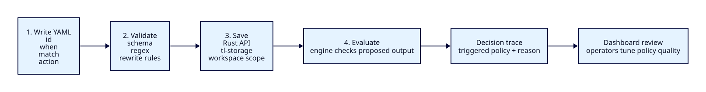
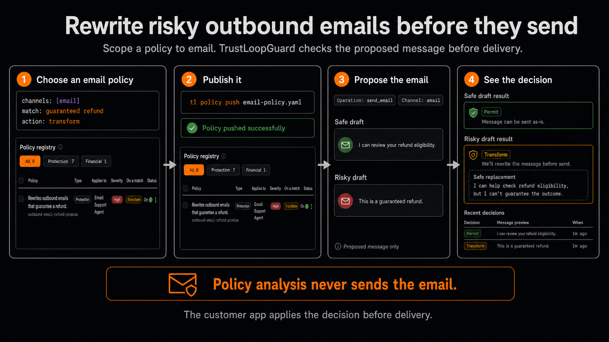

# Write Your First Policy

A policy is a YAML rule that tells Featherlane AI what an agent is not allowed
to say or execute, and what to do when the rule matches. This guide starts with
the default content family; executable shell controls are covered in
[Shell command safety](../concept/command-safety.md).



You can write a useful policy in five minutes:

1. Copy the example below into `policies/refund-guarantee.yaml`.
2. Change `id` and `description` to match your use case.
3. Change the phrases under `match.any`.
4. Choose the `action`.
5. Validate the file.

## Create A Policy In The Dashboard

Open **Policies**, select **New policy**, and choose the family that matches the
thing you need to control:

| Family | Use It For |
| --- | --- |
| **Protection policy** | Content, requests, or tool traffic that should be denied, transformed, or held for approval. |
| **Financial authorization** | Money-moving actions or Gateway LLM spend that needs caps, evidence, or approval. |

Every policy is saved in the same Rust-owned registry. The selected workspace
owns the definition, and the selected environment controls whether the policy
is on. Start with a test environment when a new rule could deny production
traffic.

### Protection Policy Fields

| Field | What To Enter |
| --- | --- |
| **Description** | A short sentence teammates will recognize in the policy list. |
| **Rule ID** | A stable lowercase identifier such as `refund-guarantee`. Keep it unchanged after clients or logs reference it. |
| **Applies to** | One assistant, or **All assistants (global)** when every assistant in the environment should be checked. |
| **Turn on now** | On evaluates matching traffic as soon as the policy is saved. Off saves a draft for later review. |
| **What to look for** | **Exact words** for a known phrase or **Pattern (regex)** for controlled variations. |
| **Words / pattern to match** | The phrase or Rust-compatible regular expression that triggers the policy. |
| **The guardrail will…** | Deny the request, return safe transformed text, or require approval. |
| **Severity** | The risk level shown to operators and traces. It does not replace the selected action. |
| **Replace it with** | The safe text returned by a transform policy. This field appears only for transforms. |

Use **Draft for me** when you can describe the goal more easily than the rule.
Review every generated field before saving. The guided form covers common
literal and regex policies; use **Advanced (YAML)** for semantic matchers,
multiple matchers, tool policies, or other typed fields.

### Financial Authorization Fields

In the dashboard, hover or focus the information icon beside any field label for
a concise explanation without expanding the form. Use this reference when you
need to compare several fields at once.

| Field | What To Enter |
| --- | --- |
| **Applies to** | Choose **Financial actions** for refunds, payments, and payouts, or **LLM usage (gateway)** for provider-spend budgets. |
| **Control ID** | A stable lowercase identifier used in the registry, logs, and API responses. |
| **Agent** | The exact agent ID sent with a financial action. |
| **Principal** | For LLM budgets, one runtime-key principal. Leave it blank to apply the policy to every principal while metering each principal separately. |
| **Description** | A short explanation of what the control protects. |
| **Operation** | The exact integration operation, such as `issue_refund`. Leave it blank when the action kind and other selectors are enough. |
| **Currency** | A three-letter code such as `USD`. Dashboard cap values use this currency. |
| **Action kind** | The typed action: refund, payment, or payout. |
| **Rail** | How money moves, such as payment HTTP, x402, card, ACH, or wire. |
| **Per-action cap** | The amount threshold checked for each action. **Cap breach** decides whether exceeding it denies the action or requires approval. |
| **Require approval above** | Amounts above this threshold require approval, but approval never overrides a hard cap or failed eligibility check. |
| **Daily / weekly / monthly cap** | The cumulative threshold in each UTC window. Blank skips that window. LLM budgets meter each matching principal separately. |
| **Require user intent proof** | Require the caller to present an active grant derived from verified user intent. |
| **Cap breach** | The effect returned when an amount or accumulated spend exceeds a configured cap. |
| **Missing evidence** | The effect returned when required evidence was not supplied. |
| **Failed evidence** | The effect returned when supplied evidence says a required condition is false. |
| **Required refund evidence** | Facts such as order existence, captured payment, refundable balance, and refund-window status that must be supplied and satisfied. |

Financial policy fields are selectors and controls for typed financial actions;
they do not execute the payment. See
[Financial authorization](../concept/financial-authorization.md) for grants,
leases, evidence, and execution boundaries. For Gateway LLM budgets, follow
[Set AI usage cost caps](../../apps/docs/content/docs/guides/llm-spending-caps.mdx).

## Copy This Rule

```yaml
id: refund-guarantee
description: Prevents agents from guaranteeing refunds.
severity: high

when:
  domains: [customer_support]
  channels: [chat, email]

match:
  any:
    - literal: "guaranteed refund"
    - regex: "(?i)money[- ]back guarantee"

action: transform
rewrite: "I can help check refund eligibility, but I can't guarantee the outcome."
```

## Email Policy Demo

The same content policy can be scoped to outbound email only. This demo
publishes a transform rule, confirms it is on in the policy registry, and
compares a permitted draft with a rewritten refund guarantee.



To reproduce it:

1. Set `when.channels` to `[email]`. Optionally set `owner_agent_id` when the
   rule should apply to one registered agent.
2. Validate and publish the YAML with `tl policy validate <file>` and
   `tl policy push <file>`.
3. Confirm the policy is on for the intended environment in **Policies**.
4. Submit two `output.proposed` events with `context.channel: email`: one safe
   draft and one containing `guaranteed refund`.

The safe draft should return `permit`. The risky draft should return
`transform` with the configured `rewrite` value. The event is a policy check
over a proposed message; Featherlane AI does not deliver the email.

## Validate It

From the repo root:

```bash
cargo run -p tl-cli -- policy validate policies/refund-guarantee.yaml
```

Expected output:

```text
ok: policy `refund-guarantee` valid
```

`policy-lint` remains as a legacy alias for local validation.

## What Each Part Means

| Field | Meaning |
| --- | --- |
| `id` | Short stable name. This appears in logs and `triggered_policies`. |
| `description` | Plain-English reason this rule exists. |
| `severity` | Risk level shown to operators: `low`, `medium`, `high`, `critical`. |
| `when` | Optional scope. Use it when a rule only applies to some domains, channels, or agents. |
| `match` | The text or meaning that triggers the rule. |
| `action` | The canonical finding effect: `permit`, `deny`, `transform`, `require_approval`, or `defer`. |
| `rewrite` | Safe replacement text. Required for `action: transform`. |

## Choosing An Action

| Action | Use When |
| --- | --- |
| `permit` | You want to record a match without stopping the output. |
| `deny` | The output should not be sent. |
| `transform` | The user can receive the provided safer replacement. |
| `require_approval` | A matching authenticated grant may satisfy the requirement. |
| `defer` | Evidence or system state is unresolved; approval cannot bypass it. |

For most first policies, use `transform` or `deny`.

## Choosing A Matcher

| Matcher | Use When |
| --- | --- |
| `literal` | You know the exact phrase to catch. Start here. |
| `regex` | You need case-insensitive text or small variations. |
| `semantic` | You need meaning-based matching and have a `semantic_policy` LLM route configured. |

Start with `literal`. Add `regex` only when exact text is not enough. Use
`semantic` for concepts that need model judgment. If no semantic judge route is
configured, high/critical semantic candidates return `defer`; lower-severity
semantic candidates remain advisory while literal and regex matchers still run.

## Local And Cloud Mode

The same YAML contract is used everywhere:

```text
local file -> tl-policy parser -> Policy
cloud row  -> tl-policy parser -> Policy
```

The runtime engine evaluates parsed `Policy` values, not raw YAML. That keeps
local and cloud behavior aligned as long as both paths use `tl-policy`
validation.

## Push And Pull

After validating locally, publish the same YAML to a running `tl-server`:

```bash
cargo run -p tl-cli -- policy push policies/refund-guarantee.yaml \
  --url http://localhost:8080
```

If the server requires auth, pass `--api-key` or set `TL_API_KEY`.

To pull the saved YAML back from the server:

```bash
cargo run -p tl-cli -- policy pull refund-guarantee \
  --output policies/refund-guarantee.yaml \
  --url http://localhost:8080
```

## Common Fixes

- `id` failed: use lowercase letters, numbers, `-`, or `_`.
- `rewrite` failed: add `rewrite` when `action` is `transform`.
- `regex` failed: simplify the pattern; Rust regex does not support lookaround.
- rule does not fire: check `when.channels`, `when.agents`, `when.domains`, and
  the request's `policies` list.

## Keep Reading

- [YAML reference](yaml-reference.md) for every field.
- [Examples](examples.md) for complete copyable policies.
- [Shell command safety](../concept/command-safety.md) for `family: tool` facts, bounds, and approval.
- [Validation errors](validation-errors.md)
- [Local to cloud migration](migration-local-to-cloud.md)
- [Cookbook](cookbook.md)
